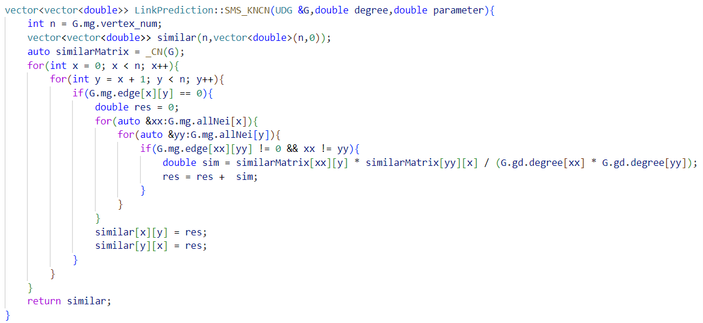

## Introduction
These files are C++ code implementations for paper: 
**Link prediction in protein-protein interaction network: a similarity multiplied similarity algorithm with paths of length three**

## run
``` ./bin/main.exe x ```

Where x represents which algorithm to run.

0 - Partition Dataset

1 - Comparative experiment

2 - Verify the impact of different similarities on the algorithms

3 - Verify the principle of complementary transmission

4 - Find the optimal parameters for the DSMS algorithm

5 - The performances of SMS, DSMS, and maxSMS algorithms based on sequence similarity

6 - The performance of SMS algorithm under mix similarity using DCN and NW

7 - The performance of DSMS algorithm under mix similarity using DCN and NW

8 - The performance of maxSMS algorithm under mix similarity using DCN and NW

9 - Calculate the distribution of the average common neighbors of the $xy$- quadrilateral graph, and the drawing tool in the tool folder.

## note
Before running the program, please divide the dataset as needed.

## contact
If you have any questions, you can contact me. My email is: caizio@qq.com

## 简介
这些文件是论文
《**Link prediction in protein-protein interaction network: a similarity multiplied similarity algorithm with paths of length three**》的C++实现

## 文件目录说明
./bin 编译后运行程序所在文件夹

./build cmake文件

./dataset 数据集

./include 头文件

./result 算法结果保存的路径

./src cpp文件

./temp 算法运行过程中中间缓存的保存文件夹

main.cpp 主函数

## 运行说明
``` ./bin/main.exe x ```

其中 x 表示运行第几个算法。

0 --- 划分数据集

1 --- 对比实验

2 --- 验证不同相似性对算法的影响

3 --- 验证互补传递原则

4 --- 寻找DSMS算法的最优参数

5 --- 序列相似性作为相似性下的SMS、DSMS、maxSMS算法的性能

6 --- 使用DCN和NW的Mix混合相似性下SMS算法的性能 

7 --- 使用DCN和NW的Mix混合相似性下DSMS算法的性能 

8 --- 使用DCN和NW的Mix混合相似性下maxSMS算法的性能 

9 --- 计算$xy$-四边图的平均共同邻居的分布，绘图工具在tool文件夹中
## 注意:
在运行1-9算法前，请先划分数据集

## SMS算法核心代码


## 联系
如果你有什么问题，可以联系我，我的邮箱：caizio@qq.com